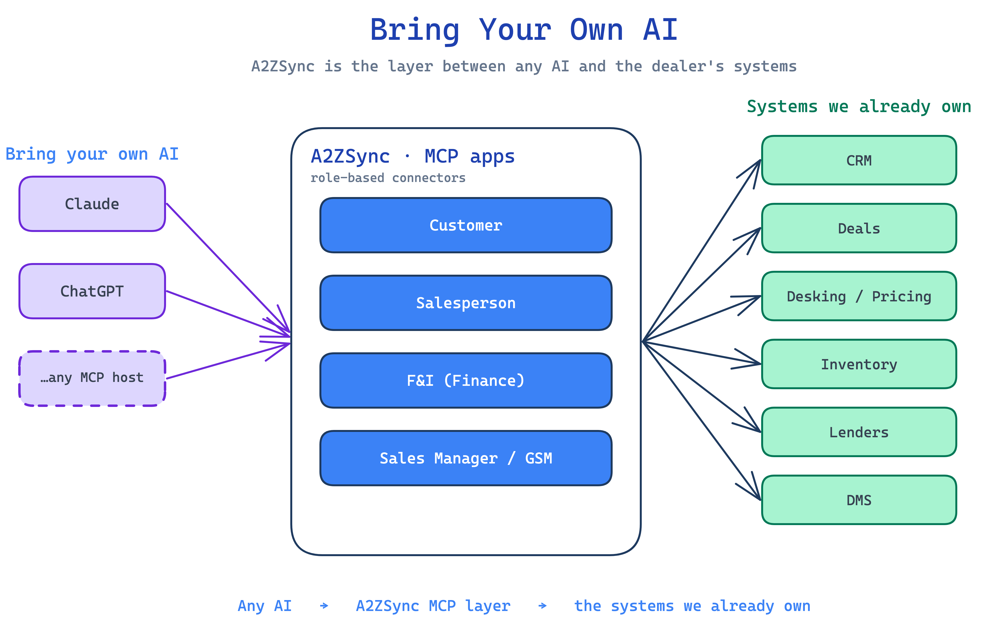

<!-- _class: lead -->

# Bring Your Own AI

### A2ZSync as the dealership's headless commerce + MCP app layer

*Run real deals — sales, F&I, management, and customer self-service — inside the AI assistant the dealer already uses.*

---

## The shift

- AI assistants (ChatGPT, Claude, …) are where people now **start their work**.
- A new, **official standard — MCP Apps** — lets a platform put its **real, interactive workflows inside those assistants**.
- The market is moving from *"a chatbot bolted onto our data"* → *"our product, as an app, inside the customer's AI."*

> This is the **apps-on-your-phone moment** for AI.

---

## The idea

**A2ZSync goes headless.** Our value is the data + services — CRM, deals, desking/pricing, inventory, lender & DMS — not any one screen.

**On top, we publish role-based MCP apps.**

**Dealers bring their own AI** and connect it to A2ZSync. We're the **connector** — the trustworthy, A2ZSync-powered tools their AI calls.

---

## The architecture

---

## One experience, by role

- **Customer** — shop inventory, real payment estimates, trade & financing — a new front door + lead channel.
- **Salesperson** — desk a deal end-to-end by talking; everything writes back to A2ZSync.
- **F&I** — work the financing queue, send to lenders, track decisions.
- **Sales Manager / GSM** — the **new "tower"**: every deal in flight, profitability, approvals — from anywhere.

*Each role sees only what it should, with the right numbers — from A2ZSync, not the AI's guesswork.*

---

## Why this wins

- **A category ahead.** Competitors are selling *chatbots over their data*. This is interactive apps **inside the dealer's own assistant**.
- **Lower risk & cost.** Bring-your-own-AI puts the **AI bill and the liability** for what the AI says on the host. We stay the **trusted source of truth**.
- **Plays to our strengths.** We already own the data, the pricing engine, and the integrations. This is an **extension**, not a new business.

---

## Proven — not a concept slide

A working prototype already runs the **full deal lifecycle across all four roles**, with interactive widgets, on **Claude and ChatGPT today**.

- Natural-language deal: find vehicle → structure numbers → trade + F&I → submit financing.
- Live, interactive pricing widgets — not chatbot text.
- Writes back to a real database.

> **Live demo available.**

---

<!-- _class: lead -->

## Where the world is going

**Not** 20 different chatbots — **bring your own AI**, and connect it to the systems that run the business.

A2ZSync is positioned to be that layer for the dealership.
